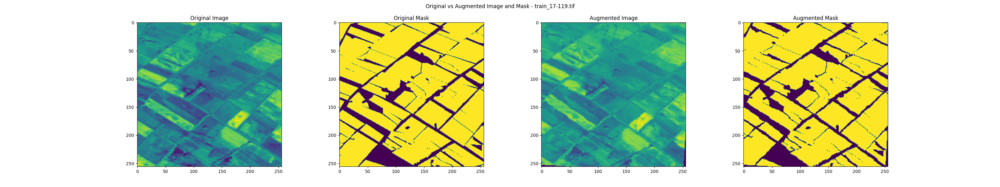
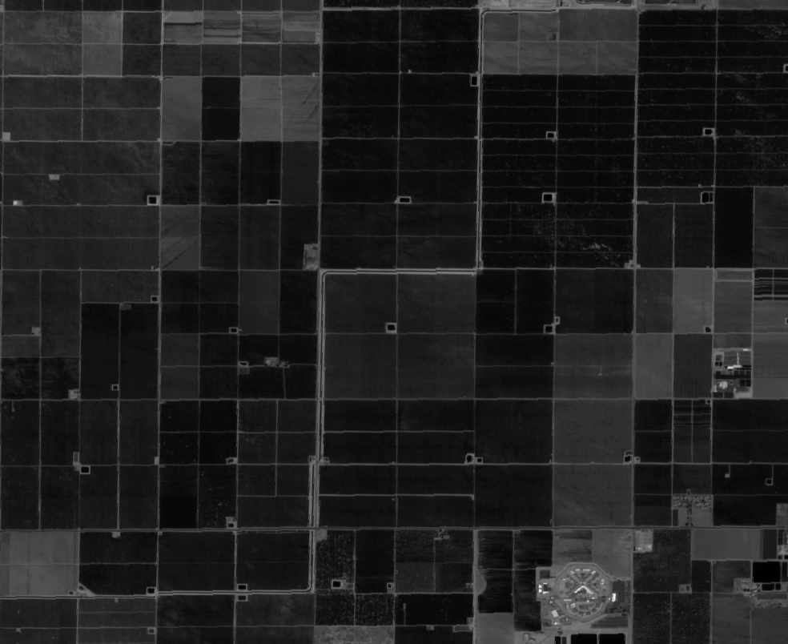

## **Sentinal-2 FarmDelineation**

- This competition is about predicting the farm land boundaries from high-resolution multi-channel satellite images.
- There were 100+ farms to be detected in a single image. 
- Used various vegetation indices like : 
    - ```NDVI``` :  Using B8 (NIR) and B4 (Red) ---> **showing density of Green Vegetation**
    - ```NDWI``` :  Using B4 (Red) and B11 (SWIR) ---> **water on Earth's surface**
    - ```NDSI``` :  Using B3 (Green) and B11 (SWIR) ---> **showing extent of snow cover**
    - ```GSI``` :   Using B4 (Red), B2 (Blue), B3 (Green) ---> **areas with advanced desertification have high GSI**


# **Pipeline :** 
- Create overlapping patches of **256x256** to reduce computation and improve performance
- Generate masks from train annotation.json
- Then [`jointly augment`](processing/data_loading.py) the patches and their corresponding masks
    

- [`Finetune segmentation models`](configs/unet_family.yaml) on these patches using joint loss [`0.1xJaccard + 0.9xFocal`](training/train_loop.py)
- Then trained ensemble model ```UNet++``` on stacked dataset (masks predicted from base models + image channels)

# **Results**
### Base Models : 
- Unet : [`Focal Loss`](Curves/UNet/Focal%20Loss.png) ,  [`Jaccard Loss`](Curves/UNet/Jaccard%20Loss.png) , [`Total Loss`](Curves/UNet/Total%20Loss.png)
- FPN : [`Focal Loss`](Curves/FPN/Focal%20Loss.png) ,  [`Jaccard Loss`](Curves/FPN/Jaccard%20Loss.png) , [`Total Loss`](Curves/FPN/Total%20Loss.png)
- DeepLabv3 : [`Focal Loss`](Curves/DeepLabv3/Focal%20Loss.png) ,  [`Jaccard Loss`](Curves/DeepLabv3/Jaccard%20Loss.png) , [`Total Loss`](Curves/UNet/Total%20Loss.png)
- Unet++ : [`Focal Loss`](Curves/Unet_PP/Focal%20Loss.png) ,  [`Jaccard Loss`](Curves/Unet_PP/Jaccard%20Loss.png) , [`Total Loss`](Curves/Unet_PP/Total%20Loss.png)

### Ensemble Model : 
- UNet++ Ensemble : 
<p align="center">
  
  
  
</p>

# **Inference**
- At [`inference`](inference.py), we create non-overlapping patches of input image (**padded so that no part is discarded**) 
- Get mask predict for each patch.
- Stitch back the masks to size of original image 

<p align="center" style="display: flex; justify-content: center; gap: 20px;">
  <figure style="text-align: center;">
    
    <figcaption>Original Input Image</figcaption>
  </figure>
  <figure style="text-align: center;">
    
    <figcaption>Stitched Mask Prediction</figcaption>
  </figure>
  <figure style="text-align: center;">
    
    <figcaption>Patched Inference</figcaption>
  </figure>
</p>


#### [***Task Planning***](https://docs.google.com/document/d/1OL07x1MMalYII_3i-l9S6eY4XyUsvQAmwcM4KSchxrI/edit?usp=sharing)

